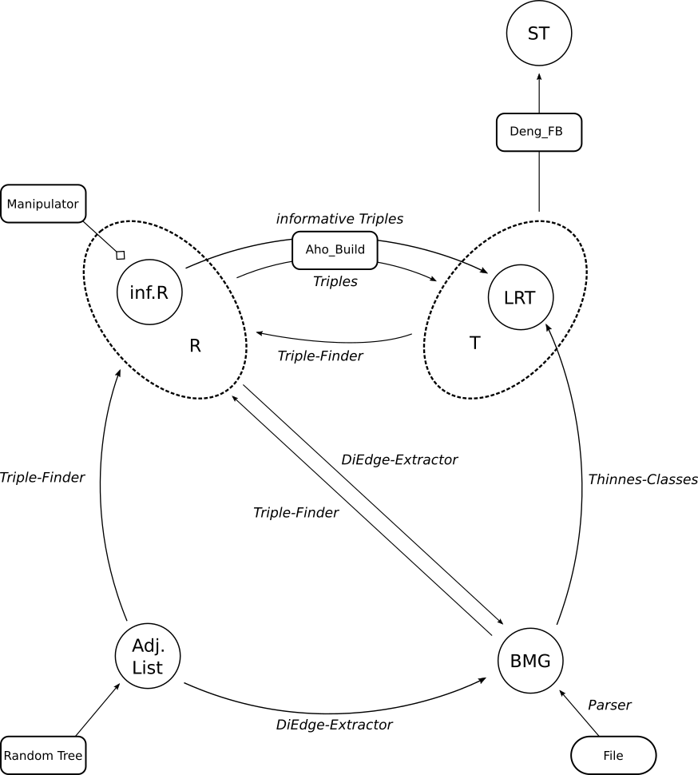

# Colored BMG Generator
An implementation of several algorithms related to phylogenetic trees.

## How to...

### ... run the programm

To run the resulting Java programm, simply execute the `./run.sh` script.
Make sure that Java itself is installed to your system and the path to the JDK is added to the PATH system environment variable.

```
./run.sh
```

### ... generate the test reports

To generate the test reports create by the test cases in `de.uni.leipzig.performance`, simply run:

```
./generate-test-reports.sh
```

## Program workflow



## Program structure

```
.
├── LICENSE
├── mvnw
├── mvnw.cmd
├── pom.xml
├── README.md
├── run.sh
└── src
    ├── main
    │   ├── java
    │   │   └── de
    │   │       └── uni
    │   │           └── leipzig
    │   │               ├── informative
    │   │               │   ├── InformativeTripleFinder.java
    │   │               │   └── model
    │   │               │       ├── InformativeTriple.java
    │   │               │       └── ThreeNodeGraph.java
    │   │               ├── Main.java
    │   │               ├── manipulation
    │   │               │   ├── DeletionManipulator.java
    │   │               │   ├── InsertionManipulator.java
    │   │               │   ├── InversionManipulator.java
    │   │               │   ├── Manipulation.java
    │   │               │   └── Manipulator.java
    │   │               ├── method
    │   │               │   ├── AhoInformative.java
    │   │               │   ├── Aho.java
    │   │               │   ├── ThinnessClass.java
    │   │               │   └── TreeCreation.java
    │   │               ├── model
    │   │               │   ├── AdjacencyList.java
    │   │               │   ├── Color.java
    │   │               │   ├── DefaultTriple.java
    │   │               │   ├── DiGraph.java
    │   │               │   ├── edges
    │   │               │   │   ├── AbstractPair.java
    │   │               │   │   ├── DiEdge.java
    │   │               │   │   ├── Edge.java
    │   │               │   │   └── SetDiEdge.java
    │   │               │   ├── Hierarchy.java
    │   │               │   ├── Neighbourhood.java
    │   │               │   ├── Node.java
    │   │               │   ├── Pair.java
    │   │               │   ├── Reachables.java
    │   │               │   ├── ThinnessClass.java
    │   │               │   ├── Tree.java
    │   │               │   ├── TripleFinder.java
    │   │               │   └── Triple.java
    │   │               ├── ncolored
    │   │               │   ├── dengfernandezbaca
    │   │               │   │   └── BuildST.java
    │   │               │   └── NColored.java
    │   │               ├── parser
    │   │               │   ├── BlastGraphLine.java
    │   │               │   └── BlastGraphParser.java
    │   │               ├── RandomTree.java
    │   │               ├── twocolored
    │   │               │   ├── axiom
    │   │               │   │   ├── Axiom1.java
    │   │               │   │   ├── Axiom2.java
    │   │               │   │   ├── Axiom3.java
    │   │               │   │   └── Axioms.java
    │   │               │   ├── DiGraphExtractor2.java
    │   │               │   ├── DiGraphExtractor.java
    │   │               │   └── ThinnessClassFinder.java
    │   │               ├── uncolored
    │   │               │   ├── AhoBuild.java
    │   │               │   ├── ConnectedComponentsConstructor.java
    │   │               │   ├── DefaultTripleFinder.java
    │   │               │   ├── DepthFirstSearch.java
    │   │               │   ├── DiGraphFromTripleSet.java
    │   │               │   └── TripleFromTree.java
    │   │               ├── user
    │   │               │   ├── Result.java
    │   │               │   └── UserInput.java
    │   │               └── Util.java
    │   └── resources
    │       ├── Tripelsets
    │       │   ├── TripelSet_180509_143744.txt
    │       │   ├── TripelSet_180509_153120.txt
    │       │   ├── TripelSet_180509_153152.txt
    │       │   ├── TripelSet_180509_153159.txt
    │       │   ├── TripelSet_180509_153209.txt
    │       │   ├── TripelSet_180509_153340.txt
    │       │   ├── TripelSet_180509_153356.txt
    │       │   ├── TripelSet_180509_153446.txt
    │       │   └── TripelSet_180509_164840.txt
    │       ├── triple_set_easy.txt
    │       ├── triple_set_generated_easy.txt
    │       ├── triple_set_generated_medium.txt
    │       ├── triple_set_medium_inverted.txt
    │       └── triple_set_medium.txt
    └── test
        ├── java
        │   └── de
        │       └── uni
        │           └── leipzig
        │               ├── informative
        │               │   ├── InformativeTripleFinderTest.java
        │               │   └── model
        │               │       ├── InformativeTripleTest.java
        │               │       └── ThreeNodeGraphTest.java
        │               ├── MainTest.java
        │               ├── manipulation
        │               │   ├── DeletionManipulatorTest.java
        │               │   ├── InsertionManipulatorTest.java
        │               │   ├── InversionManipulatorTest.java
        │               │   └── ManipulationTest.java
        │               ├── method
        │               │   ├── AhoInformativeTest.java
        │               │   ├── AhoTest.java
        │               │   ├── ThinnessClassTest.java
        │               │   └── TreeCreationTest.java
        │               ├── model
        │               │   ├── DiGraphTest.java
        │               │   ├── edges
        │               │   │   ├── DiEdgeTest.java
        │               │   │   ├── EdgeTest.java
        │               │   │   └── SetDiEdgeTest.java
        │               │   ├── HierarchyTest.java
        │               │   ├── NodeTest.java
        │               │   ├── ReachablesTest.java
        │               │   ├── ThinnessClassTest.java
        │               │   ├── TreeTest.java
        │               │   └── TripleTest.java
        │               ├── parser
        │               │   ├── BlastGraphLineTest.java
        │               │   └── BlastGraphParserTest.java
        │               ├── RandomTreeTest.java
        │               ├── twocolored
        │               │   ├── axiom
        │               │   │   └── AxiomsTest.java
        │               │   ├── DiGraphExtractorTest.java
        │               │   └── ThinnessClassFinderTest.java
        │               ├── uncolored
        │               │   ├── AhoBuildTest.java
        │               │   └── DefaultTripleFinderTest.java
        │               ├── user
        │               │   ├── ResultTest.java
        │               │   └── UserInputTest.java
        │               └── UtilTest.java
        └── resources
            └── de
                └── uni
                   └── leipzig
                        └── parser
                            ├── complete.blast-graph
                            ├── parser-test.blast-graph
                            ├── three-colored.blast-graph
                            └── two-colored.blast-graph 
```
